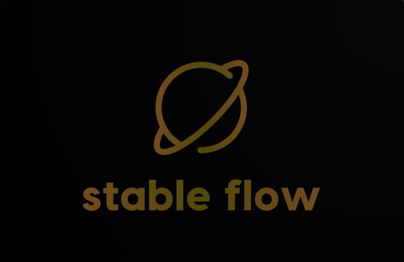

<h1 align="center">
  
</h1>

## 项目简介

StableFlow 是一个去中心化稳定币协议，集成了 **账户抽象**、**多抵押品机制** 和 **全自动风险管理**。协议采用模块化架构，为 DeFi 生态系统提供安全、高效、可扩展的稳定币基础设施

## 功能特性

### 智能账户抽象 (ERC-4337)
- **智能合约钱包** - 每个用户拥有独立的智能合约账户
- **无 Gas 交易** - 支持第三方代付 Gas 费用
- **批量交易执行** - 单笔交易完成多个操作，大幅节省 Gas 费用
- **社交恢复机制** - 多签名监护人系统，防止私钥丢失风险
- **自定义交易逻辑** - 支持复杂条件执行和交易规则定制
- **冻结机制** - 支持冻结、解冻账户，保护账户安全

### 多抵押品稳定币引擎
- **超额抵押机制** - 最低 200% 抵押率确保系统安全
- **多币种支持** - 支持 WETH, WBTC

### 智能自动补仓系统
- **7×24 小时监控** - 持续监控抵押品抵押率，提前预警潜在清算风险，保护用户资产
- **多资产补仓支持** - 支持使用不同资产组合进行补仓
- **灵活配置** - 用户可以自定义抵押率、自动补仓阈值

### 社交恢复与监护系统
- **多监护人网络** - 用户可配置 3-5 名可信监护人
- **渐进式恢复** - 需要多数监护人批准才能执行账户恢复
- **时间锁保护** - 防止恶意恢复攻击，确保账户安全
- **灵活配置** - 监护人、时间锁等特性支持用户自定义配置

### Aave 协议集成
- **收益叠加优化** - 抵押品存入 Aave 协议获得额外收益
- **流动性挖矿参与** - 自动参与 Aave 流动性激励计划

### 模块化插件架构
- **可扩展设计** - 支持快速添加新功能和集成
- **定制化配置** - 用户可以根据需求启用或禁用特定功能

## 快速开始

### 安装 Foundry

参考 Foundry 官方文档：https://getfoundry.sh/

### 安装依赖

```shell
forge install
```

### 构建项目

```shell
forge build
```

### 测试

启动本地 anvil

```shell
anvil
```

启动 ethereum sepolia fork

```shell
make-anvil-sepolia
```

执行测试

```shell
forge test
```

### 智能合约账户配置

配置文件位置：`script/config/AccountConfig.json`

```json
{
  "customVaultConfig": {
    "autoTopUpEnabled": true,
    "autoTopUpThreshold": 2500000000000000000,
    "collateralRatio": 2500000000000000000
  },
  "customRecoveryConfig": {
    "guardians": [],
    "minGuardianApprovals": 0,
    "recoveryTimeLock": 0,
    "socialRecoveryEnabled": false
  }
}
```

#### 金库配置 `customVaultConfig`

- `autoTopUpEnabled`: 是否开启自动补仓
- `autoTopUpThreshold`: 自动补仓抵押率阈值
- `collateralRatio`: 自定义抵押率
- `upkeepGasLimit`: Chainlink Upkeep 自动补仓 gas 限制
- `upkeepLinkAmount`: Chainlink Upkeep 初始 link token 数量

#### 社交恢复配置 `customRecoveryConfig`

- `guardians`: 监护人地址
- `minGuardianApprovals`: 执行社交恢复需要的最小监护人投票数量
- `recoveryTimeLock`: 执行社交恢复的时间锁，单位为秒，从监护人投票通过后开始计算
- `socialRecoveryEnabled`: 是否开启社交恢复

